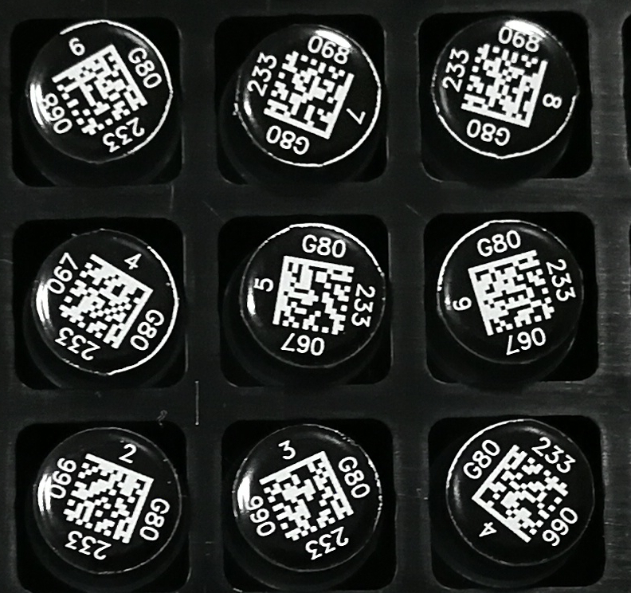

# limbus-qrtk

An extremely simplistic QR/DataMatrix/Barcode toolkit for the [LImBuS](https://www.github.com/AberystwythSystemsBiology/limbus/) project.

## Setup

This project makes use of the ```dmtx``` library, so you need to install the headings for it to work.

If you are running a Fedora system, use the following command:

```bash
sudo dnf install libdmtx-devel
```

Now once you have done this, install limbus-qrtk using pip:

```
pip install limbus-qrtk
```

## Usage

There's an example in the ```examples``` directory of the repository, but the following is pretty much all you need to get started.

First of all, import the library using the following command:

```python
>>> from limbus_qrtk import DataMatrixReader
```

Now, we want to load in an image of our DataMatrix array. It should look something like this:



```

>>> dmr = DataMatrixReader("./path/to/image.jpg")

>>> dmr.to_limbus_json()
{
    "date": "2019-10-01 00:21:26.545732",
    "number_rows": 3,
    "number_columns": 3,
    "number_items": 9,
    "data": {
        "G802330674": {
            "row": 1,
            "column": 0
        },
        "G802330675": {
            "row": 1,
            "column": 1
        },
        "G802330663": {
            "row": 0,
            "column": 1
        } ...
}
```

## Bug reporting and feature suggestions

Please report all bugs or feature suggestions to the [issues tracker](https://www.github.com/AberystwythSystemsBiology/limbus-qrtk/issues). Please do not email me directly as I'm struggling to keep track of what needs to be fixed.

We welcome all sorts of contribution, so please be as candid as you want(!)

## License

This project is proudly licensed under the [GNU General Public License v3.0](https://raw.githubusercontent.com/AberystwythSystemsBiology/limbus-qrtk/LICENSE).
